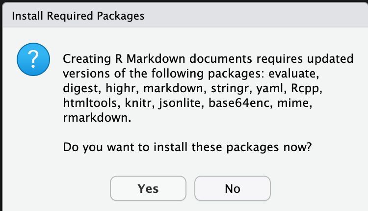
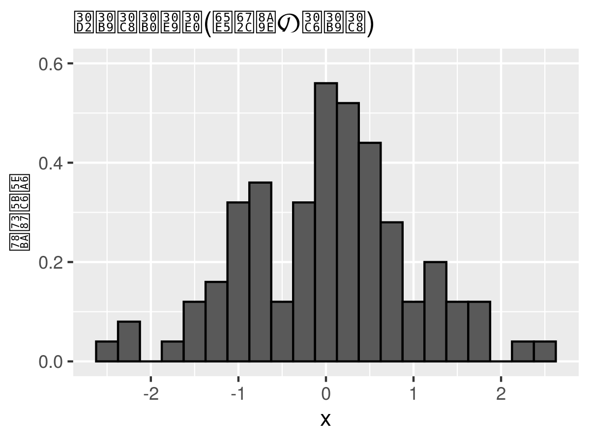

# イントロダクション

## 予習と講義動画の視聴

トピック1でやるべきことは、以下のとおりである。

1. [シラバス(PDFファイル)](http://yukiyanai.github.io/jp/classes/econometrics2/docs/syllabus-applied-econometrics_2020-2Q.pdf) をよく読む。遠隔授業に変更になったことにより、大学の公式サイトに載っているものとは内容が異なるので、このリンクにある最新のPDF版を読むこと。
2.  [KUTLMS (Moodle)](https://lms.kochi-tech.ac.jp/course/view.php?id=793) にあるトピック1の講義動画を視聴する。
3. この資料の続きを読み、トピック2以降の授業に備える。
  - 特に、最後の課題を忘れずに。

## Slack

### Slack とは？

この授業では、担当教員と受講生の間、あるいは受講生同士の間の連絡手段として、[Slack](https://slack.com/intl/ja-jp/) を使う。この授業には**無料**版で十分なので、間違って支払いをしないように注意。

授業に関連する連絡や、オフィスアワー以外の質問の受付はすべてSlack で行うので、**必ずSlackが使えるように**しておくこと。準備期間として6月18日まではメールでの質問も受け付けるが、その後は基本的に**メールでの質問は受け付けない**（とは言っても、実際にはメールに気付けば回答する。メールはたまにしかチェックしない上に、知らない人からのメール（送信者名が設定されていないメール）や添付ファイルがあるメールは読まないので、メールで質問しても読まれていないと思ったほうがいいというだけのことである。また、Slackのほうが回答が早い）。

スマホ用のアプリもあるが、課題の提出とフィードバック（つまり、ファイルの送受信）に利用するので、パソコンで使えるようにしておくこと。パソコンでは、パソコン用のアプリを使うか、アプリをインストールせずにウェブブラウザ上で使うことができる。

Slack を使ったことがないなら、以下の資料が参考になる。

- [Slack 初心者のためのクイックスタートガイド](https://slack.com/intl/ja-jp/resources/using-slack/your-quick-start-guide-to-slack)
- [【完全初心者向け！】コミュニケーションツールSlack（スラック）の使い方](https://techacademy.jp/magazine/10217)
- [初心者がSlackを使いこなすために知っておきたい6つのポイント](https://ferret-plus.com/8172)


### 授業用ワークスペースへの登録

この授業専用のSlack ワークスペース「計量経済学応用」に登録するためのURLは、ポータルから送信済みである（2020年6月8日午前8時に送信）。登録済みでない者は、ポータルのメッセージを確認すること。**登録には、KUTのメールアドレス (@ugs.kochi-tech.ac.jp) が必要**である。

メンバー登録するときに決める表示名は、匿名でもかまわない（ただし、担当教員はメールアドレスから個人を特定できるので注意）。

KUTのメールアドレスがどうしても使えないという場合は、以下の内容のメールを担当教員宛に送ること（メールアドレスはシラバス・講義スライドに記載されている）。

- 件名（メールのタイトル）：計量経済学応用 Slack用メールアドレス
- 本文に以下の内容を記載
  - 氏名
  - 学籍番号
  - Slackへの登録で使いたいメールアドレス
  - 匿名での登録を希望する場合、希望の「表示名」（後で変更可能; 指定がない場合は本名で登録する）

必要事項が記載されたメールが届いたら登録する。登録確認のメールが届くはずなので、確認すること。

### 利用上の注意

Slack での発言は授業への参加点に加算するので、積極的に質問してほしい。また、質問だけでなく、他の受講生からの質問に回答したり、Slack 上で議論することも歓迎する（加点する）。対面授業であれば授業中に議論できるが、2020年度の授業は遠隔で実施することになり、毎回 Zoom 等で議論する時間的余裕もない。そこで、Slack で議論の場を設けることとしたい。

また、初めての遠隔授業で担当教員も暗中模索の状態なので、授業の進め方に関する意見も歓迎する。

Slack に投稿する際には以下の点に気をつけてくれると嬉しい（守らなくても減点するわけではない）。

- 余計な挨拶を毎回書かないこと（メールではないので）
  - 「余計」なものの例：
    - 「お世話になっております」（私の心の声：「早く本題に入って」）
    - 「計量経済学を受講している〇〇です」（「そうでしょうね。名前は表示されてますよ。」）
    - 「経済・マネジメント学群3年の〇〇です」（「経・マネの学生なんて珍しいですね（棒読み）。名前は...(略）」）
    - 「質問してもいいですか？」（「早く質問して」）
- どの内容についての質問か明確にすること
  - 授業を決められた時間に受ける必要はないので、人によって受講するペースが違うことが想定される：「今日の授業」と言われてもどの授業かわからない
  - 例えば、以下のように質問してくれるとわかりやすい
    - 操作変数法のスライドの、p.15 について質問：（以下、質問の内容）
    - 補助教材の 1.3.3 のカスタマイズについて質問：（以下、質問の内容）
    - 課題4の問3について：（以下、質問の内容）
    
- 投稿の際は、適切なチャンネルを選ぶこと
  - 特に、ダイレクトメッセージの場合には、誤った相手に送信しないように注意
- 提出したファイルが届いたかどうか質問しないで！
  - Slack上にファイルがアップロードされていることをあなたが確認できれば、私からも見えるのでご心配なく。
  - この質問の優先順位は最下位に設定する

**禁止事項**：以下の行為は禁止する

- 他人を誹謗・中傷するような書き込み
- 他人の著作物のアップロード

これらの行為は学業上の不正行為である。見つけた場合には教務部に報告する。万が一、他の受講生からハラスメント行為を受けた場合は、証拠を保全（スクリーンショットを撮るなど）して担当教員に連絡してほしい。皆さんはもう大学3年生なので、誹謗・中傷（相手を貶める行為）と批判（相手を高めるために、相手の「**議論**」の弱点を指摘して、**改善策を一緒に見つける**こと）の違いをわきまえましょう。
  


## RStudio Cloud の初期設定

まず、RStduio Cloud を使うための初期設定をしよう。RStudio Cloud ではなく、自分のパソコンにインストールした（あるいは情報演習室のパソコンにインストールされている）RStudio を使う場合は、自分の環境に合わせて適宜読み替えること。
  
念のためにもう1度注意しておくが、この授業は「統計学2」と「計量経済学」を受講済みであることを前提にしている。よって、受講生は全員RStudio（デスクトップ版）の基本的な使い方を理解していると仮定して、RStudio Cloud の使い方を説明する。

たとえば、「プロジェクトとは何？」、「パッケージとは何？」という疑問がある人は、この資料を読んでも内容が理解できないかもしれない。そういう人は、「統計学2」や「計量経済学」を先に受講（あるいは復習）してからもう一度挑戦してほしい。

### ユーザ登録

[RStudio Cloud](https://rstudio.cloud) にアクセスしてログイン (Log In) する。初めて使う場合は、登録（サインアップ [Sign Up]）が必要である。自分で決めたパスワードを忘れないように注意。


### 授業用のプロジェクトを作る

RStudio Cloud のアカウントを作り、無事にログインできたら、この授業で使うプロジェクトを作ろう。
Projects タブを開いて [New Project] ボタンを押せば、新しいプロジェクトを作成することができる。
新規プロジェクトが立ち上がると、画面上部に [**Your Workspace / Untitled Project**] と表示されるので、"Untitled Project" の部分をクリックしてプロジェクトに名前を（アルファベットと数字で）つけよう。好きな名前をつけて良い。2つ目の計量経済学 (Econometics) の授業なので、"metrics2" などとしておけばいいだろう。

デスクトップ版のRStudio を使う場合は、いつも通りの方法で授業用のプロジェクトを作ろう。


### RStudio のカスタマイズ

まず、RStudio Cloud を自分が使いやすいようにカスタマイズしよう。[Tools] -> [Global Options] を開いてカスタマイズする。どのようにカスタマイズすべきかについては、[RとRStudio のインストール方法を解説した資料](http://yukiyanai.github.io/jp/resources/) の後半に書いてある。

デスクトップ版とは異なり（実際には、デスクトップ版でも複数のバージョンをインストールしていれば選べるが）、RStudio Cloud ではRのバージョンが選べるので、Global Options の [General] -> [Basic] で、[Default versions of R:] を **R version 3.6.3" に設定しよう。

（この資料を作成した時点での最新版は R 4.0.0 である。大学の情報演習室にインストールされているのが R 3.6.3 であり、今年度中は更新されないので、そちらに合わせる。2020年6月9日現在、自分のパソコンに新たにR
をインストールするとバージョンが4.0.1になるはずだが、その場合はその 4.0.1 で問題ない。）

### パッケージのインストール

次に、授業で使うことが予想されるパッケージをインストールしてしまおう。

まず、RStuido Cloud で新たにR Markdown ファイルを作成してみよう（File -> New File -> R Markdown）。初めてこれをやると、次のような表示が出るはずだ。



これが表示されたら、[Yes] をクリックしよう。すると、RMarkdown を使うために必要なパッケージがインストールされる。あとはデスクトップ版と同じようにR Markdown ファイルが使える。

続いて、「計量経済学」の授業でも毎回お世話になった **tidyverse** パッケージをインストールしよう。RStudio Cloud の Console で次のコードを実行する。
```{r, eval = FALSE}
install.packages("tidyverse")
```

このインストールには少し時間がかかる。待っている間に、**tidyverse**が**ggplot2**, **dplyr**, **readr** などの便利なパッケージをまとめたパッケージ群であることを思い出そう。最近、**dplyr** のバージョンが上がり、「計量経済学」で勉強したときとは使い方が少し変わっているので注意しよう（授業で説明するので心配無用）。

次に、**pacman** パッケージをインストールする。
```{r, eval = FALSE}
install.packages("pacman")
```

**pacman** パッケージは、パッケージの読み込みとインストールに利用する。
これまでは、`install.packages()` でパッケージをインストールし、インストール済みのパッケージを`library()` で読み込んで使っていた。この方法は、今後も引き続き使える。しかし、この方法だと、`library()` を使うためにはパッケージがインストール済みでなければいけないという問題がある（実際には全然「問題」ではなく、単に面倒だというだけ）。

この問題は。`pacman::p_load()` を使うことで（ほとんどの場合）解決する。この方法の利点は2つある。

1. インストール済みでないパッケージを指定すると、（そのパッケージが[CRAN](https://cran.r-project.org/)に登録されていれば）読み込む前にインスト－ルしてくれる。
1. 複数パッケージの読み込みが一度にできる。

試しに、既にインストール済みの **tidyverse** と、まだインストールしていない（はずの）**patchwork**、**estimatr**, **devtools**, **showtext**の計5
つのパッケージを同時に読み込んでみよう。
```{r, eval = FALSE}
pacman::p_load(tidyverse, patchwork, estimatr, devtools, showtext)
```
```{r, include = FALSE}
library(tidyverse)
library(patchwork)
```
**patchwork** 、**estimatr**、**devtools**、**showtext** の4つのパッケージのインストールと、既にインストール済みの**tidyverse**を合わせた5つのパッケージの読み込みが完了した。

試しに使ってみよう。
```{r, fig.width = 6, fig.height = 3}
set.seed(321)
myd <- tibble(x = rnorm(100),
              y = rnorm(100))
p1 <- ggplot(myd, aes(x = x, y = after_stat(density))) +
  geom_histogram(binwidth = 0.25, color = "black") + 
  ylim(0, 0.6)
p2 <- ggplot(myd, aes(x = y, y = after_stat(density))) +
  geom_histogram(binwidth = 0.25, color = "black", fill = "dodgerblue") +
  ylim(0, 0.6)
plot(p1 + p2)
```

tibble とggplot2 (どちらもtidyverseに含まれる) と patchwork が使えることがわかる。

`pacman::p_load()` で書いたコマンドは、**pacman** なしだと次のように書かなければならない。
```{r, eval = FALSE}
install.pakcages(c("patchwork", "estimatr", "devtools", "showtext"))
library(tidyverse)
library(patchwork)
library(esimatr)
library(devtools)
library(showtext)
```

複数のパッケージを読み込むだけ（すべてのパッケージがインストール済み）なら次のようにも書けるが、やや面倒だ。
```{r, eval = FALSE}
sapply(c("tidyverse", "patchwork", "estimatr", "devtools", "showtext"),
       require, character.only = TRUE)
```

今後、この授業では `pacman::p_laod()` でパッケージの読み込みを行う。

ただし、CRANに登録されていないパッケージは手動でインストールする必要がある。GitHub にアップロードされているパッケージは、`devtools::install_github()` または `remotes::install_github()` でインストールする。

試しに、宋財泫 (SONG Jaehyun) さんが作って GitHub で公開している **BalanceR** パッケージをインストールしてみよう。
```{r, eval = FALSE}
devtools::install_github("JaehyunSong/BalanceR")
```
インストールさえ済めば、`pacman::p_load()` が使える。
```{r, eval = FALSE}
pacman::p_load(BalanceR)
```

CRANに登録されていないパッケージを授業で使う場合は、その都度インストールを指示する。


### ディレクトリの作成

授業でよく使うディレクトリ（フォルダ）を作っておこう。（ファイルパスに自分で対応できるなら、ここは自分の好みで変えて良い。）

`dir.create()` で2つのディレクトリを作る。
```{r, eval = FALSE}
dir.create("data")
dir.create("figs")
```

今後、授業で使うデータセットは **data** ディレクトリに、作成した図は **figs** ディレクトリに保存する。


### 図で日本語が使えるようにする

日本語の論文・レポート用に図を作るとき、軸ラベルやタイトルには日本語を使う。RStudio Cloud ではなくデスクトップ版のRStudio を使うとき、Windowsなら特に何もしなくてもggplot2 で日本語が使える（この資料はmacOS で作っているので、図は省略）。
```{r, eval = FALSE}
p1_jp <- p1 + labs(y = "確率密度", title = "ヒストグラム（日本語のテスト）")
plot(p1_jp)  
```

Mac でも、次のように`them_set()` で `base_family` を指定すれば日本語が使える。
```{r, fig.height= 3, fig.width = 4}
theme_set(theme_gray(base_size = 10, base_family = "HiraginoSans-W3"))
p1_jp <- p1 + labs(y = "確率密度", title = "ヒストグラム（日本語のテスト）")
plot(p1_jp)  
```

しかし、RStudio Cloud だと次のような図になってしまう。


この問題に対処するために、日本語が表示できるフォントを使う。次のように指定する。
```{r, eval = FALSE}
sysfonts::font_add_google(name = "Noto Sans JP", family = "noto")
showtext::showtext_auto()
theme_set(theme_gray(base_size = 10, base_family = "noto"))
```

上のコマンドを実行したら、もう1度図を表示してみる
```{r, eval = FALSE}
plot(p1_jpn)
```
図は省略するが、RStudio Cloud に表示されている図では、先ほどと同じように日本語が文字化けしているだろう。
しかし、これをファイルに保存すれば、日本語が正しく表示される。

次のコマンドで図をPDFファイルに保存する。（PNGファイルにするには、`.pdf`を`.png` に変えれば良い。ただし、上の `base_size` のところで文字サイズを調整する必要がある。）
```{r, eval = FALSE}
ggsave(filename = "figs/japanese-test.pdf", plot = p1_jpn,
       width = 4, height = 3)
```
**figs** ディレクトリに japanese-test.pdf というファイルができているので、クリックして開いてみよう。日本語が正しく表示されているはずだ。


### R Markdown からPDFファイルを作る

統計学2と計量経済学では、R Markdown からHTML ファイルを作る（"knit" する）方法を学んだ。 そのときに少し説明したが、R Markdown からPDF ファイルを作ることもできる。今年度は遠隔授業でファイルによる課題提出が必要になるので、HTMLをブラウザに表示したものを印刷して提出する代わりに、PDFファイルで提出してもらう。（どうしても
HTMLしかできなれけば、HTMLブラウザで表示して、表示された内容 を「ファイルに印刷」してPDFファイルを作ってもかまわない。）

そこで、R Markdown ファイルからPDFファイルを作る方法を説明する。この方法を身につければ、卒業論文も R Markdown で書ける（草川先生が作ってくれた卒論用テンプレートがある。草川先生に感謝しましょう）。

必要なパッケージをインストールするが、デスクトップ版のRStudio を使っていて、既に[LaTeX](https://texwiki.texjp.org/?%E3%81%AF%E3%81%98%E3%82%81%E3%81%A6%E3%81%AE%E6%96%B9%E3%81%B8) （TeX Live やMacTeX など）がインストールされているなら、これはインストールしなくて良い（しないほうが良いかも）。

まず、次のコマンドを実行して **tinytex** をインストールする。
```{r, eval = FALSE}
pacman::p_load(tinytex)
install_tinytex()
```

デスクトップ版のRStudio を使っている場合は、インストールが完了したら一旦RStudio を終了し、再起動する。

これができたら、.Rmd ファイルのYAMLヘッダを以下のように書けば、本文に日本語を含む PDF ファイルが knit できる（初めてPDFをknitするときは、追加で必要なものがインストールされる [よって、ネット接続が必須] ので時間がかかる。）。date 以下はコピペで良い。
```{eval = FALSE}
---
title: "計量経済学応用"
subtitle: "日本語PDFできるかな"
author: "猫好きのRユーザ"
date: "`r Sys.Date()`"
output:
  pdf_document:
    highlight: tango
    latex_engine: xelatex
    toc: false
header-includes:
  - \usepackage{zxjatype}
  - \usepackage[haranoaji]{zxjafont}
documentclass: bxjsarticle
---
```
ただし、この時点では**図の中に日本語があるとエラー**が出るので、日本語入りの図がない状態で一度 knit してみよう。（ここでは、haranoaji で原ノ味フォントを指定している。**自分で他のフォントが使える状態にできるなら**、他のフォントでも良い。例えば、ヒラギノフォント [hiragino-pron] やIPAex フォント [ipaex] などにしても良いだろう。）

しかし、RStduio Cloud では、平仮名の「う」がなぜが表示されない（誰か助けて...）。他にも表示されない文字があるかもしない（気付いたら教えてほしい）。この授業では、「う」が表示されていなくても大目に見る（皆さんのせいではないので）。

また、出来上がったPDFファイルをクリックしてダウンロードすると、ファイル名が file_show　に代わり、ファイル名拡張子もなくなっている。これはファイルをダウンロードした後に自分でファイル名を付け直す（.pdf も忘れずに）か、次の手順でファイルをダウンロードすれば良い（ggplotで作った図をPDFにした場合にも、この方法を使う）。

1. RStudio Cloud の[Files] タブで、ファイル名の左にあるチェックボックスにチェックをつける。
2. [More] -> [Export] を選択する。
3. 正しいファイル名が表示されていることを確認して [Download] をクリックする。

日本語を使った図が含まれるR Markdown ファイルをPDF にknit するためには、次のようなRチャンクをR Markdown ファイルの最初のほう（YAML ヘッダのすぐ後）に書いておく。
````
`r ''````{r global_option, include = FALSE}
knitr::opts_chunk$set(warning = FALSE, echo = TRUE, message = FALSE, 
                      fig.height = 3, fig.width = 4, 
                      dev = "cairo_pdf")
`r ''````
````
ここで重要なのは、 `dev = "cairo_pdf"`  を指定することである。
また、デスクトップ版のRStudioでは、PDFに日本語の図を入れる際に日本語フォントの指定が必要である。
（Macを使っていて[XQuartz](https://www.xquartz.org/) もインストールされているなら、`cairo_pdf` の代わりに `quartz_pdf` も使える。）


Macならいつも通りに、
```{r}
theme_set(theme_gray(base_size = 10, base_family = "HiraginoSans-W3"))
```
と、書く。

Windows でも、PDF をknit する場合には同様の作業が必要である。ヒラギノフォントが使えないので、次のようにする。
```{r, eval = FALSE}
theme_set(theme_gray(base_size = 10, base_family = "Meiryo"))
```

Ubuntuの場合は、（IPAex フォントがあるという前提で）次のようにする。
```{r, eval = FALSE}
theme_set(theme_gray(base_size = 10, base_family = "ipaex"))
```
これらのうち、自分のOSに合ったもの1つを、**tidyverse**（または **ggplot2**） パッケージを読み込んだ直後に一度書いておけばよい。これで、図に日本語が含まれていても PDFがknit される。

ただし、RStudio Cloud を使っている場合は、これでも文字化けが直らない。文字化けした図が表示されるようになるだけである。このように、RStudio Cloud は日本語の処理に難がある。
この授業では、図のラベルや凡例などはすべて英語でも減点しない。意味がわかればローマ字 でも良い （例：Mitsudo）。しかし、これは不便なので、やはり自分のパソコンにRとRStudio をインストールして使ったほうが良いだろう。インストール手順については、[ココ](http://yukiyanai.github.io/jp/resources/) にある資料を参照。

.Rmd ファイルのサンプルをRStudio Cloud 上の [KUT_R プロジェクト](https://rstudio.cloud/project/762403) に
置いておくので、必要なら自分のOS用のファイルをダウンロードして中身を確認されたい。

- macOS用：jpntest_mac.Rmd
- Ubuntu用：jpntest_ubuntu.Rmd
- Windows用：jpntest_win.Rmd
- RStudio Cloud用：jpntest_cloud.Rmd （図の日本語は文字化けする）


RStudio Cloud を閉じるとき、ブラウザ（あるいはタブ）を閉じてもRセッションが終了しないので、コンソールに`q("no")`と入力してRを終了しよう。


## トピック1の課題

上のサンプル（.Rmd ファイル）を参考にして、R Markdown ファイルから PDFファイルを作りなさい。その際、以下の指示を守ること。

- 図をヒストグラム以外（例えば、バイオリン図や散布図など）に変えなさい。
- 図の説明を日本語で加えなさい（1文で十分）。
- ヘッダ部分に、自分の氏名を書きなさい。
- サブタイトルは、「課題1」に変えなさい。
- 提出するファイル名：**metrics2_hw01_LastFirst.pdf**
  - LastFirstの部分を自分の名前に変えること。
  - 例：metrics2_hw01_YanaiYuki.pdf
- **提出期限：2020年6月19日午後5時**（日本時間）
- 提出方法：Slack のダイレクトメッセージで矢内に送る。


